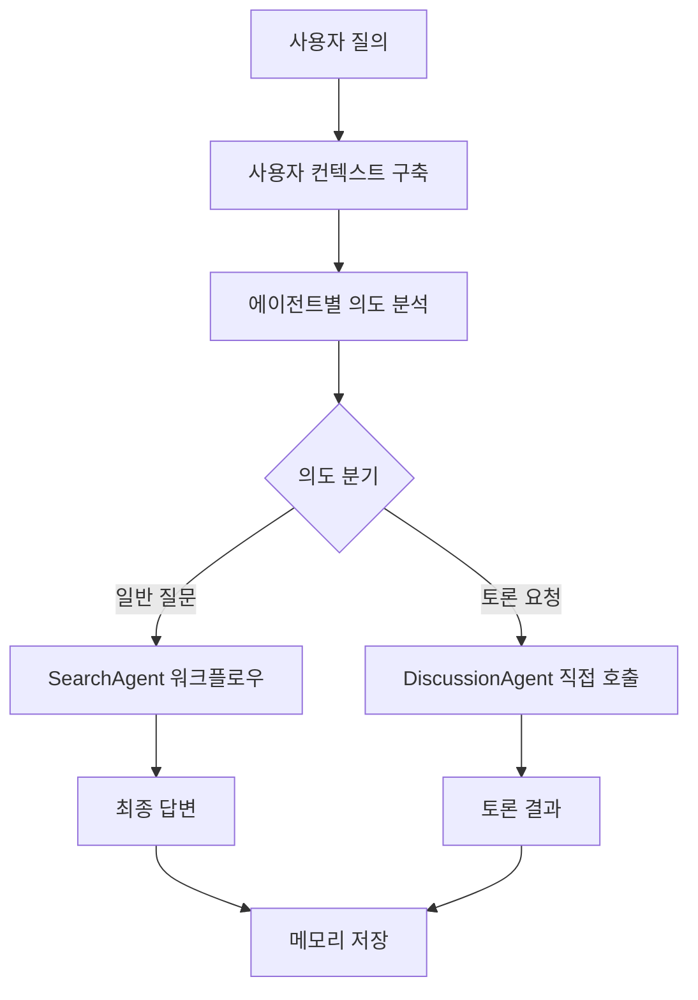

# Expert Agents

LangGraph 기반의 AI 에이전트 시스템으로, 실시간 채팅과 메모리 시스템을 제공합니다.

## 🤖 제공 에이전트

- **CAIA (Chief AI Advisor)**: C레벨 임원전용 AI
- **SearchAgent**: 웹 검색 및 도구 실행을 통한 정보 수집  
- **DiscussionAgent**: 토론 및 심층 분석

## 🚀 주요 기능

- **실시간 채팅**: SSE 기반 스트리밍 채팅
- **채팅방 관리**: Session ID 기반 채팅방 및 메시지 히스토리 자동 저장
- **메모리 시스템**: STM(Redis) + LTM(MySQL) 기반 컨텍스트 유지
- **데이터베이스 ORM**: SQLAlchemy 2.0 + Alembic 기반 스키마 관리
- **SSO 로그인**: 쿠키 기반 엘지니 SSO 통합 인증
- **MCP 통합**: Model Context Protocol을 통한 엘지니 툴 연동
- **통합 에이전트 시스템**: 
  - 통합된 에이전트 인터페이스 (`BaseAgent`)
  - 의도 기반 자동 라우팅 (`AgentRegistry`)
  - 독립적이고 확장 가능한 에이전트 아키텍처
  - 실시간 멀티 LLM 스트리밍 지원

## 📦 빠른 시작

### 로컬 개발 환경

```bash
# Python 3.11 환경 설정
python -m venv .venv
source .venv/bin/activate  # Windows: .venv\Scripts\activate

# 의존성 설치
pip install -e .

# 환경 변수 설정
cp infra/compose/env.example .env
# .env 파일에서 필요한 환경변수 설정

# 데이터베이스 초기화
uv run expert-agents db init

# 서버 실행
python main.py
```

### 데이터베이스 관리

```bash
# 데이터베이스 연결 확인
uv run expert-agents db check

# Migration 생성
uv run expert-agents db create-migration -m "Add new feature"

# Migration 적용
uv run expert-agents db upgrade

# Migration 상태 확인
uv run expert-agents db current
```

### API Key 관리

LexAI API 등 외부 API 접근을 위한 API Key를 관리할 수 있습니다.

#### CLI 도구

```bash
# API Key 생성
python -m src.database.cli.api_key_cli create "LexAI 프로덕션 키" 365

# API Key 목록 조회
python -m src.database.cli.api_key_cli list

# 비활성화된 키 포함 조회
python -m src.database.cli.api_key_cli list --include-inactive

# API Key 비활성화
python -m src.database.cli.api_key_cli deactivate <key_id>
```

#### REST API

Swagger UI에서 확인: `http://localhost:8000/docs` → "API Key 관리" 섹션

**주요 엔드포인트**:
- `POST /api/v1/api-keys` - API Key 생성
- `GET /api/v1/api-keys` - 목록 조회 (필터: `include_inactive`, `agent_code`)
- `GET /api/v1/api-keys/{key_id}` - 상세 조회
- `POST /api/v1/api-keys/{key_id}/deactivate` - 비활성화
- `POST /api/v1/api-keys/{key_id}/agent-permissions?agent_code=lexai` - Agent 권한 추가
- `DELETE /api/v1/api-keys/{key_id}/agent-permissions/{agent_code}` - Agent 권한 제거

**사용 예시**:
```bash
# API Key 생성 (LexAI 전용)
curl -X POST "http://localhost:8000/api/v1/api-keys" \
  -H "Content-Type: application/json" \
  -d '{
    "name": "LexAI 프로덕션 키",
    "expires_in_days": 365,
    "agent_codes": ["lexai"]
  }'

# 목록 조회
curl "http://localhost:8000/api/v1/api-keys"

# LexAI 전용 키만 조회
curl "http://localhost:8000/api/v1/api-keys?agent_code=lexai"
```

**참고사항**:
- 생성된 API Key는 한 번만 표시되므로 안전하게 보관하세요
- API Key는 SHA-256 해시로 저장되어 평문으로 복구할 수 없습니다
- Agent별 권한을 설정하여 특정 Agent만 접근 가능하도록 제한할 수 있습니다
- 권한이 없는 API Key는 모든 Agent에 접근 가능합니다 (하위 호환성)

## 📡 API 사용법

localhost:8000/docs #swagger 참조
```

### 주요 엔드포인트

- `GET /health` - 서비스 헬스체크
- `POST /{agent_code}/api/v1/chat/stream` - SSE 스트리밍 채팅 (에이전트별 엔드포인트)
- `GET /{agent_code}/api/v1/auth/sso_login` - SSO 로그인
- `GET /memory/stats/{user_id}` - 메모리 통계 조회

**엔드포인트 구조 설명**:
- 현재는 **에이전트별 분리된 엔드포인트** 구조를 사용합니다
- 예: `/caia/api/v1/chat/stream`, `/raih/api/v1/chat/stream`
- 이 구조는 에이전트별 명확한 경로 분리, RESTful 설계, 확장성 등의 장점이 있습니다
- 향후 통합 쿼리 서비스로 전환 시에도 현재 구조를 유지하면서 통합 엔드포인트를 추가하는 방식으로 점진적 마이그레이션이 가능합니다

## 📊 로깅 시스템

### 파일 로깅

- **위치**: `/app/logs/expert-agents.log`
- **로테이션**: 10MB마다 자동 백업 (최대 5개)
- **이중 출력**: 콘솔과 파일에 동시 출력
- **환경변수**: `LOG_LEVEL`, `LOG_DIR`, `LOG_MAX_SIZE_MB` 등으로 설정


## 🧠 메모리 시스템

### 메모리 구조

- **STM (Short-Term Memory)**: Redis에 저장되는 세션별 대화 기록
- **LTM (Long-Term Memory)**: MySQL에 저장되는 장기 기억
- **인사정보**: SSO 로그인 시 자동 저장되는 사용자 조직 정보


## 🔌 MCP 통합

### MCP 서버

- **LGenie MCP**: 외부 도구 연동을 위한 MCP 서버
- **도구 동적 로딩**: 런타임에 사용 가능한 도구 목록 조회

### MCP 설정

```yaml
# src/capabilities/registry.yaml
servers:
  external:
    lgenie-mcp:
      endpoint: ${LGENIE_ENDPOINT}/lgenie-mcp/mcp
      headers:
        X-API-Key: ${LGENIE_MCP_API_KEY}
```

## 🤖 에이전트 시스템

### 에이전트 아키텍처

현재 시스템은 **완전히 일반화된 에이전트 아키텍처**를 제공합니다. 새로운 에이전트 추가 시 기존 코드 수정 없이 독립적으로 개발해야합니다.

#### 1. **통합된 에이전트 인터페이스** (`BaseAgent`)
- 모든 에이전트가 구현해야 하는 공통 인터페이스
- 실시간 스트리밍 지원 (`run()` 메서드)
- LangGraph 통합 (`run_for_langgraph()` 메서드)
- 의도별 처리 가능 여부 확인 (`can_handle_intent()`)

#### 2. **에이전트별 의도 분석 서비스** (`AgentIntentService`)
- 각 에이전트가 독립적인 의도 분석 로직을 가질 수 있음
- 에이전트 코드 기반으로 적절한 의도 분석기 자동 생성
- 현재는 CAIA만 의도 분석기 보유, 에이전트 추가 시 분기 추가 필요

#### 3. **에이전트 레지스트리** (`AgentRegistry`)
- **관리 대상**: `BaseAgent` 인스턴스 (CAIAAgent, RAIHAgent 등)
- **관리 방식**: 의도(intent)별 매핑 (`intent → agent_name`)
- **주요 메서드**: `register_agent()`, `get_agent_for_intent()`
- **사용 목적**: "어떤 에이전트를 실행할까?" 결정 (의도 분석 후)
- **예시**: `"general_question"` 의도 → `CAIAAgent` 선택

#### 4. **오케스트레이션 레지스트리** (`OrchestrationRegistry`)
- **관리 대상**: `BaseAgentOrchestrator`, `AgentResponseHandler`
- **관리 방식**: 에이전트 코드(agent_code)별 매핑 (`agent_code → orchestrator/handler`)
- **주요 메서드**: `register_orchestrator()`, `register_response_handler()`, `get_response_handler()`
- **사용 목적**: "어떻게 실행하고 응답을 처리할까?" 담당 (워크플로우 실행 및 SSE 응답 변환)
- **예시**: `"caia"` 코드 → `CAIAOrchestrator` + `CAIAResponseHandler` 조회

**핵심 차이점**:
- `AgentRegistry`: **의도 기반** 에이전트 선택 (어떤 에이전트?)
- `OrchestrationRegistry`: **코드 기반** 실행 컴포넌트 관리 (어떻게 실행?)

### 현재 에이전트들

#### **CAIA (Chief AI Advisor)**
- **역할**: 메인 에이전트, 의도 분류 및 라우팅 담당
- **지원 의도**: `general_question`, `discussion`
- **특징**:
  - 사용자 쿼리의 의도를 분석하여 적절한 하위 에이전트로 라우팅
  - 일반 질문 → SearchAgent, 토론 요청 → DiscussionAgent
  - 통합된 사용자 경험 제공

#### **SearchAgent**
- **역할**: CAIA의 하위 에이전트 (일반 질문 처리)
- **기능**: 웹 검색, 도구 실행, 정보 수집
- **특징**: 
  - 도구 계획 수립 → 도구 실행 → 결과 압축
  - MCP 도구 통합 지원
  - 실시간 스트리밍 지원

#### **DiscussionAgent**
- **역할**: CAIA의 하위 에이전트 (토론 처리)
- **기능**: 토론 시뮬레이션, 심층 분석
- **특징**:
  - 토론 설정 → 자료 수집 → 토론 진행 → 요약
  - 13명의 전문가 참가자 시뮬레이션
  - WOW Point 도출
  - **실시간 멀티 LLM 스트리밍** (각 발화자별 실시간 응답)

### 에이전트별 독립적인 워크플로우(CAIA 예시)



### 아키텍처 특징

#### **에이전트별 독립성**
- **독립적인 의도 분석**: 각 에이전트가 자신만의 의도 분석 로직을 가질 수 있음
- **확장성**: 새로운 에이전트 추가 시 독립적인 의도 분석기 구현 가능
- **단순성**: 복잡한 통합 서비스 없이 에이전트별로 단순한 구조

#### **명확한 역할 분담**
- **CAIA**: 메인 에이전트, 의도 분류 및 라우팅 담당
- **하위 에이전트**: SearchAgent, DiscussionAgent는 CAIA에서 라우팅됨
- **새로운 에이전트**: 독립적인 의도 분석기 구현으로 완전한 독립성 확보

#### **단순화된 구조**
- **책임 분리**: 각 에이전트가 자신의 의도 분석만 담당
- **재사용성**: 공통 컴포넌트와 에이전트별 컴포넌트가 명확히 구분
- **유지보수성**: 복잡한 통합 로직 없이 각 에이전트별로 독립적 관리

## 🏗️ 프로젝트 구조

```
src/
├─ agents/                    # 에이전트 시스템
│  ├─ base_agent.py          # 통합된 에이전트 인터페이스
│  ├─ agent_registry.py      # 에이전트 레지스트리 (의도별 매핑)
│  ├─ caia_agent.py          # CAIA 에이전트
│  ├─ raih_agent.py          # RAIH 에이전트
│  ├─ search_agent.py        # SearchAgent (CAIA 하위, 현재 사용x)
│  ├─ discussion_agent.py    # DiscussionAgent (CAIA 하위)
│  ├─ services/              # 에이전트 서비스
│  │  ├─ agent_intent_service.py   # 에이전트별 의도 분석 서비스
│  │  ├─ intent_analyzer_factory.py # 의도 분석기 팩토리
│  │  └─ intent_analyzer_service.py # 의도 분석기 서비스
│  ├─ components/            # 에이전트 컴포넌트
│  │  ├─ caia/               # CAIA 전용 컴포넌트
│  │  ├─ raih/               # RAIH 전용 컴포넌트
│  │  ├─ search_agent/       # SearchAgent 전용 컴포넌트
│  │  ├─ discussion/         # DiscussionAgent 전용 컴포넌트
│  │  └─ common/             # 공통 컴포넌트 (LLM, Tool Registry 등)
│  ├─ nodes/                 # LangGraph 노드
│  │  ├─ caia/               # CAIA 전용 노드
│  │  ├─ raih/               # RAIH 전용 노드
│  │  ├─ search_agent/       # SearchAgent 노드
│  │  ├─ discussion/         # DiscussionAgent 노드
│  │  └─ common/             # 공통 노드 (LLM, Tool 등)
│  └─ tools/                 # 도구들
│     ├─ caia/               # CAIA 전용 도구
│     ├─ search_agent/       # SearchAgent 전용 도구
│     ├─ mcp/                # MCP 도구 (LGenie 통합)
│     └─ common/             # 공통 도구 (Web Search, LLM Knowledge 등)
├─ orchestration/            # 워크플로우 오케스트레이션
│  ├─ common/               # 공통 오케스트레이션 모듈
│  │  ├─ base_orchestrator.py    # BaseOrchestrator 인터페이스
│  │  ├─ base_state.py           # BaseAgentState 인터페이스
│  │  ├─ agent_interface.py     # OrchestrationRegistry, ResponseHandler
│  │  └─ workflow_registry.py    # WorkflowRegistry
│  ├─ caia/                 # CAIA 전용 오케스트레이션
│  │  ├─ caia_orchestrator.py    # CAIA 오케스트레이터
│  │  ├─ caia_state_builder.py   # CAIA 상태 빌더
│  │  └─ caia_response_handler.py # CAIA 응답 처리기
│  ├─ raih/                 # RAIH 전용 오케스트레이션
│  │  ├─ raih_orchestrator.py    # RAIH 오케스트레이터
│  │  ├─ raih_state_builder.py   # RAIH 상태 빌더
│  │  └─ raih_response_handler.py # RAIH 응답 처리기
│  ├─ discussion/           # Discussion 전용 오케스트레이션
│  │  └─ discussion_orchestrator.py
│  ├─ search_agent/          # SearchAgent 전용 오케스트레이션
│  │  └─ search_agent_orchestrator.py
│  ├─ states/               # 상태 정의
│  │  ├─ caia_state.py      # CAIA 상태
│  │  ├─ raih_state.py      # RAIH 상태
│  │  ├─ discussion_state.py # Discussion 상태
│  │  └─ search_state.py    # SearchAgent 상태
│  └─ caia_archetecture.md  # CAIA 아키텍처 문서
├─ memory/                  # 메모리 시스템 (MySQL + Redis)
│  ├─ memory_manager.py     # 메모리 매니저
│  ├─ providers/            # 메모리 프로바이더
│  │  ├─ factory.py         # MemoryProviderFactory
│  │  ├─ mysql_provider.py  # MySQL 프로바이더 (LTM)
│  │  └─ redis_provider.py  # Redis 프로바이더 (STM)
│  ├─ services/             # 메모리 서비스
│  └─ schemas/              # 메모리 스키마
├─ capabilities/            # MCP 통합
│  ├─ mcp_service.py        # MCP 서비스
│  ├─ registry_manager.py   # MCP 레지스트리 관리
│  ├─ registry.yaml         # MCP 서버 설정
│  └─ servers/              # MCP 서버 구현
│     ├─ external/          # 외부 MCP 서버 (LGenie)
│     └─ internal/          # 내부 MCP 서버
├─ database/                 # 데이터베이스 시스템
│  ├─ connection/           # DB 연결 관리
│  │  ├─ connection.py      # SQLAlchemy 연결 및 세션 관리
│  │  └─ dependencies.py    # FastAPI 의존성 주입
│  ├─ models/               # ORM 모델
│  │  ├─ agent.py          # Agent 모델
│  │  ├─ chat.py            # Chat 모델 (Channel, Message)
│  │  ├─ memory.py          # Memory 모델
│  │  ├─ user.py            # User 모델
│  │  └─ lgenie_models.py   # LGenie 모델
│  ├─ services/             # 데이터베이스 서비스
│  │  ├─ base_orm_service.py    # ORM 기반 공통 서비스
│  │  ├─ database_service.py    # DatabaseService (의존성 주입 지원)
│  │  ├─ agent_services.py      # Agent 관련 서비스
│  │  ├─ chat_services.py        # Chat 관련 서비스
│  │  ├─ memory_service.py       # Memory 관련 서비스
│  │  ├─ user_services.py         # User 관련 서비스
│  │  └─ lgenie_sync_service.py  # LGenie 동기화 서비스
│  └─ cli/                  # DB CLI 도구
│     ├─ cli.py             # DB CLI 명령어
│     └─ migrate_to_lgenie.py # LGenie 마이그레이션
├─ apps/                    # 애플리케이션
│  ├─ api/                  # REST API + SSE 채팅
│  │  ├─ main.py            # FastAPI 앱 및 레지스트리 초기화
│  │  ├─ routers/           # API 라우터
│  │  │  ├─ base_router.py      # 기본 라우터
│  │  │  ├─ chat/               # 채팅 라우터
│  │  │  │  ├─ chat_router.py       # 동적 에이전트 채팅 라우터
│  │  │  │  ├─ chat_generator.py    # 통합 채팅 응답 생성기
│  │  │  │  ├─ chat_management_router.py # 채팅 관리 라우터
│  │  │  │  ├─ workflow_manager_v2.py    # 워크플로우 매니저
│  │  │  │  └─ stream_manager.py         # 스트림 관리
│  │  │  ├─ auth/            # 인증 라우터
│  │  │  ├─ logs/            # 로그 라우터
│  │  │  └─ memory/          # 메모리 라우터
│  │  ├─ security/          # 보안 모듈
│  │  │  ├─ authorization_service.py # 인가 서비스
│  │  │  └─ sso_parser.py    # SSO 파서
│  │  ├─ user/               # 사용자 관리
│  │  │  ├─ user_service.py  # 사용자 서비스
│  │  │  └─ user_manager.py  # 사용자 매니저
│  │  └─ logging/            # 로깅 모듈
│  │     └─ sse_log_handler.py # SSE 로그 핸들러
│  └─ cli/                  # CLI 도구
│     └─ main.py            # CLI 진입점
├─ llm/                     # LLM 관리 시스템
│  ├─ manager.py            # LLM 매니저
│  ├─ interfaces/           # LLM 인터페이스
│  │  ├─ base.py            # 기본 인터페이스
│  │  └─ chat.py            # 채팅 인터페이스
│  └─ providers/            # LLM 프로바이더
│     ├─ base.py            # 기본 프로바이더
│     └─ openai_provider.py # OpenAI 프로바이더
├─ prompts/                 # 프롬프트 템플릿
│  ├─ prompt_manager.py     # 프롬프트 매니저
│  ├─ base/                 # 기본 프롬프트
│  └─ templates/            # Jinja2 템플릿
│     ├─ caia/              # CAIA 템플릿
│     ├─ raih/              # RAIH 템플릿
│     ├─ discussion/        # Discussion 템플릿
│     └─ search_agent/     # SearchAgent 템플릿
├─ schemas/                 # JSON 스키마
│  ├─ sse_response.py       # SSE 응답 스키마
│  ├─ user_schemas.py       # 사용자 스키마
│  ├─ tool_result_schema.py # 도구 결과 스키마
│  └─ exceptions.py         # 예외 스키마
└─ utils/                   # 유틸리티
   ├─ config_utils.py       # 설정 유틸리티
   ├─ db_utils.py           # DB 유틸리티
   ├─ log_collector.py      # 로그 수집기
   ├─ mcp_utils.py          # MCP 유틸리티
   └─ timezone_utils.py     # 타임존 유틸리티
```

## 🌐 API 엔드포인트 구조

### 현재 구조: 에이전트별 분리된 엔드포인트

현재 시스템은 **에이전트별로 분리된 엔드포인트**를 사용합니다:

```
POST /{agent_code}/api/v1/chat/stream
```

**예시**:
- `/caia/api/v1/chat/stream` - CAIA 에이전트 채팅
- `/raih/api/v1/chat/stream` - RAIH 에이전트 채팅

**이 구조의 장점**:
1. **명확한 경로 분리**: 각 에이전트가 독립적인 엔드포인트를 가짐
2. **RESTful 설계**: 리소스(에이전트)별로 명확한 경로 구조
3. **확장성**: 새로운 에이전트 추가 시 자동으로 엔드포인트 생성
4. **유연성**: 에이전트별로 다른 인증/권한 설정 가능
5. **하위 호환성**: 향후 통합 엔드포인트 추가 시 기존 엔드포인트 유지 가능

**향후 통합 쿼리 서비스 전환 시**:
- 현재 구조를 유지하면서 통합 엔드포인트 추가 가능
- 예: `POST /api/v1/chat/stream` (agent_code를 body나 query param으로 받음)
- 점진적 마이그레이션으로 하위 호환성 보장

## 🏛️ 아키텍처 패턴

### Registry 패턴

시스템은 여러 레지스트리를 사용하여 컴포넌트를 관리합니다:

#### 1. **AgentRegistry** (`src/agents/agent_registry.py`)
- **역할**: BaseAgent 인스턴스 관리 및 의도별 매핑
- **관리 대상**: CAIAAgent, RAIHAgent 등
- **사용 목적**: 의도 분석 후 적절한 에이전트 선택

```python
from src.agents.agent_registry import agent_registry

# 에이전트 등록
agent_registry.register_agent(CAIAAgent())

# 의도별 에이전트 조회
agent = agent_registry.get_agent_for_intent("general_question")
```

#### 2. **WorkflowRegistry** (`src/orchestration/common/workflow_registry.py`)
- **역할**: 에이전트별 오케스트레이터와 상태 빌더 관리
- **관리 대상**: BaseOrchestrator, AgentStateBuilder
- **사용 목적**: 워크플로우 실행을 위한 오케스트레이터 조회

```python
from src.orchestration.common.workflow_registry import workflow_registry

# 오케스트레이터 등록
workflow_registry.register_orchestrator("caia", caia_orchestrator)
workflow_registry.register_state_builder("caia", caia_state_builder)

# 오케스트레이터 조회
orchestrator = workflow_registry.get_orchestrator("caia")
```

#### 3. **OrchestrationRegistry** (`src/orchestration/common/agent_interface.py`)
- **역할**: 오케스트레이션 컴포넌트 관리 (오케스트레이터, 응답 처리기)
- **관리 대상**: BaseAgentOrchestrator, AgentResponseHandler
- **사용 목적**: SSE 응답 처리를 위한 Response Handler 동적 로딩

```python
from src.orchestration.common.agent_interface import orchestration_registry

# Response Handler 등록
orchestration_registry.register_response_handler("caia", caia_response_handler)

# Response Handler 조회 (동적 로딩)
handler = orchestration_registry.get_response_handler("caia")
```

### Factory 패턴

시스템은 여러 Factory를 사용하여 컴포넌트를 생성합니다:

#### 1. **OrchestratorFactory** (`src/apps/api/main.py`)
- **역할**: 에이전트 코드에 따라 적절한 오케스트레이터 반환
- **사용 위치**: FastAPI 라우터에서 오케스트레이터 조회

```python
class OrchestratorFactory:
    @classmethod
    def get_orchestrator(cls, agent_code: str):
        from src.orchestration.common.workflow_registry import workflow_registry
        return workflow_registry.get_orchestrator(agent_code)
```

#### 2. **IntentAnalyzerFactory** (`src/agents/services/intent_analyzer_factory.py`)
- **역할**: 에이전트별 의도 분석기 생성
- **사용 목적**: AgentIntentService에서 의도 분석기 동적 생성

```python
from src.agents.services.intent_analyzer_factory import IntentAnalyzerFactory

analyzer = IntentAnalyzerFactory.create_analyzer("caia")
```

#### 3. **MemoryProviderFactory** (`src/memory/providers/factory.py`)
- **역할**: 메모리 프로바이더 생성 (MySQL, Redis)
- **사용 목적**: 메모리 매니저 초기화 시 프로바이더 선택

```python
from src.memory.providers.factory import MemoryProviderFactory

provider = factory.create_provider({"provider": "mysql", ...})
```

### Service 레벨 구조

#### 1. **ORM 기반 서비스** (`src/database/services/base_orm_service.py`)
- **역할**: SQLAlchemy ORM을 사용한 공통 CRUD 작업
- **특징**: Generic 타입을 사용하여 모델별 서비스 생성

```python
from src.database.services.base_orm_service import ORMService
from src.database.models import User

class UserService(ORMService[User]):
    pass

# 사용
user_service = UserService(User)
user = user_service.create(db, name="John", email="john@example.com")
```

#### 2. **DatabaseService** (`src/database/services/database_service.py`)
- **역할**: 원시 SQL 쿼리 실행 및 데이터베이스 작업
- **특징**: 의존성 주입 패턴 지원 (하위 호환성 유지)

```python
from src.database.services.database_service import DatabaseService

# 의존성 주입 사용 (권장)
def my_endpoint(db: Session = Depends(get_db)):
    service = DatabaseService(db_session=db)
    result = service.select_one("users", "id, name", "id = %s", (1,))

# 자동 세션 생성 (하위 호환성)
service = DatabaseService()
result = service.select_one("users", "id, name", "id = %s", (1,))
```

#### 3. **에이전트 서비스** (`src/agents/services/`)
- **AgentIntentService**: 에이전트별 의도 분석
- **IntentAnalyzerService**: 의도 분석기 래퍼

### 데이터베이스 연결 구조

#### 1. **연결 관리** (`src/database/connection/connection.py`)
- **역할**: SQLAlchemy 엔진 및 세션 팩토리 관리
- **특징**: 
  - 메인 DB와 LGenie DB 분리 관리
  - Connection pooling 지원
  - FastAPI 의존성 주입 지원

```python
from src.database.connection import get_db, get_lgenie_db

# FastAPI 의존성으로 사용
@app.get("/users")
def get_users(db: Session = Depends(get_db)):
    # db 세션 사용
    pass
```

#### 2. **의존성 주입** (`src/database/connection/dependencies.py`)
- **역할**: FastAPI에서 사용할 수 있는 DB 세션 의존성 제공
- **사용법**: `Depends(get_database_session)` 형태로 사용

```python
from src.database.connection.dependencies import DatabaseSession

@app.get("/users")
def get_users(db: DatabaseSession):
    # db 세션 자동 주입
    pass
```

#### 3. **세션 라이프사이클**
- FastAPI 요청 시작 시 세션 생성
- 요청 종료 시 자동으로 세션 닫힘
- 트랜잭션 관리: commit/rollback 자동 처리

## 📚 API 문서

서버 실행 후 다음 URL에서 API 문서를 확인할 수 있습니다:

- **Swagger UI**: http://localhost:8000/docs
- **ReDoc**: http://localhost:8000/redoc


## 🚨 문제 해결

### 서비스가 시작되지 않는 경우

1. 환경 변수 설정 확인
2. 데이터베이스 연결 확인: `DATABASE_URL`, `REDIS_URL`
3. 헬스체크: `curl http://localhost:8000/health`

### 로그 확인

```bash
# 로컬 환경
tail -f /app/logs/expert-agents.log
```

## 📝 개발 가이드

### 새로운 에이전트 개발

#### 1. **에이전트 클래스 생성** (`src/agents/{NEW_AGENT}.py`)
```python
from src.agents.base_agent import BaseAgent
from src.orchestration.states.caia_state import CAIAAgentState

class {NEW_AGENT}(BaseAgent):
    def __init__(self):
        super().__init__(
            name="{NEW_AGENT}",
            description="새로운 에이전트 설명"
        )
    
    async def run(self, state: CAIAAgentState) -> AsyncGenerator[str, None]:
        """실시간 스트리밍 실행"""
        # 에이전트별 스트리밍 로직 구현
        pass
    
    async def run_for_langgraph(self, state: CAIAAgentState) -> Dict[str, Any]:
        """LangGraph용 실행 (비스트리밍)"""
        # LangGraph 워크플로우용 로직 구현
        pass
    
    def supported_intents(self) -> list[str]:
        """지원하는 의도 목록"""
        return ["{NEW_INTENT_1}", "{NEW_INTENT_2}"]
```

#### 2. **의도 분석기 생성** (`src/agents/components/{NEW_AGENT}/{NEW_AGENT}_intent_analyzer.py`)
```python
from src.agents.components.common.intent_analyzer_interface import BaseIntentAnalyzer
from src.agents.components.common.llm_component import LLMComponent

class {NEW_AGENT}IntentAnalyzer(LLMComponent, BaseIntentAnalyzer):
    def __init__(self):
        super().__init__()
    
    async def analyze_intent(self, query: str, chat_history=None, user_context=None):
        """에이전트별 의도 분석 로직"""
        # LLM 기반 의도 분석 구현
        pass
    
    def get_supported_intents(self) -> list[str]:
        return ["{NEW_INTENT_1}", "{NEW_INTENT_2}"]
    
    def get_intent_enum(self):
        return {NEW_AGENT}QueryIntent
```

#### 3. **에이전트 레지스트리 등록** (`src/agents/agent_registry.py`)
```python
from src.agents.{NEW_AGENT} import {NEW_AGENT}

# 앱 시작 시 에이전트 등록
agent_registry.register_agent({NEW_AGENT}())
```

#### 4. **AgentIntentService 확장** (`src/agents/services/agent_intent_service.py`)
```python
def _create_intent_analyzer(self):
    """에이전트 코드에 따라 적절한 의도 분석기를 생성합니다."""
    if self.agent_code == "caia":
        from src.agents.components.caia.caia_intent_analyzer import CAIAQueryAnalyzer
        return CAIAQueryAnalyzer()
    elif self.agent_code == "{NEW_AGENT}":
        from src.agents.components.{NEW_AGENT}.{NEW_AGENT}_intent_analyzer import {NEW_AGENT}IntentAnalyzer
        return {NEW_AGENT}IntentAnalyzer()
    else:
        return None
```

#### 5. **필요 컴포넌트/툴/노드 개발**
- `src/agents/components/{NEW_AGENT}/` - 에이전트 전용 컴포넌트
- `src/agents/tools/{NEW_AGENT}/` - 에이전트 전용 도구
- `src/agents/nodes/{NEW_AGENT}/` - LangGraph 노드
- 중복 기능은 기존 컴포넌트나 툴을 최대한 활용

#### 6. **프롬프트 템플릿 추가** (`src/prompts/templates/{NEW_AGENT}/`)
- 에이전트별 전용 프롬프트 템플릿 개발
- Jinja2 템플릿 형식으로 작성

#### 7. **워크플로우 개발**

##### **오케스트레이터 구현** (`src/orchestration/{NEW_AGENT}/{NEW_AGENT}_orchestrator.py`)
```python
from src.orchestration.common.base_orchestrator import BaseOrchestrator
from src.orchestration.common.base_state import AgentStateBuilder
from langgraph.graph import StateGraph, END

class {NEW_AGENT}Orchestrator(BaseOrchestrator):
    def __init__(self):
        super().__init__("{NEW_AGENT}")
        # 에이전트별 초기화 로직
    
    def build_workflow(self) -> StateGraph:
        """에이전트별 워크플로우 구성"""
        workflow = StateGraph({NEW_AGENT}State)
        
        # 노드 추가
        workflow.add_node("node1", self._node1)
        workflow.add_node("node2", self._node2)
        
        # 엣지 정의
        workflow.set_entry_point("node1")
        workflow.add_edge("node1", "node2")
        workflow.add_edge("node2", END)
        
        return workflow
    
    def get_state_schema(self) -> type:
        return {NEW_AGENT}State
    
    def get_entry_point(self) -> str:
        return "node1"
```

##### **상태 빌더 구현** (`src/orchestration/{NEW_AGENT}/{NEW_AGENT}_state_builder.py`)
```python
from src.orchestration.common.base_state import AgentStateBuilder

class {NEW_AGENT}StateBuilder(AgentStateBuilder):
    def create_state(self, user_query, messages, **kwargs):
        """에이전트별 상태 생성"""
        return {
            **self.get_common_fields(),
            "user_query": user_query,
            "messages": messages,
            # 에이전트별 추가 필드들
        }
    
    def get_state_schema(self) -> type:
        return {NEW_AGENT}State
```

##### **워크플로우 등록** (`src/apps/api/main.py`)
```python
# lifespan 함수에 추가
from src.orchestration.common.workflow_registry import workflow_registry
from src.orchestration.{NEW_AGENT}.{NEW_AGENT}_orchestrator import {NEW_AGENT}Orchestrator
from src.orchestration.{NEW_AGENT}.{NEW_AGENT}_state_builder import {NEW_AGENT}StateBuilder

# 워크플로우 등록
{NEW_AGENT}_orchestrator = {NEW_AGENT}Orchestrator()
{NEW_AGENT}_state_builder = {NEW_AGENT}StateBuilder()

workflow_registry.register_orchestrator("{NEW_AGENT}", {NEW_AGENT}_orchestrator)
workflow_registry.register_state_builder("{NEW_AGENT}", {NEW_AGENT}_state_builder)
```

#### 8. **SSE 응답 처리 구현** (`src/orchestration/{NEW_AGENT}/{NEW_AGENT}_response_handler.py`)

새로운 에이전트의 워크플로우 노드 출력을 SSE(Server-Sent Events) 형식으로 변환하기 위해 Response Handler를 구현해야 합니다.

##### **Response Handler 생성**

```python
from src.orchestration.common.agent_interface import (
    AgentResponseHandler,
    StandardAgentResponseHandler,
)
from src.schemas.sse_response import SSEResponse, MessageResponse
import asyncio
from typing import Any, AsyncGenerator, List
from logging import getLogger

logger = getLogger("{NEW_AGENT}_response_handler")


class {NEW_AGENT}ResponseHandler(StandardAgentResponseHandler):
    """{NEW_AGENT} 에이전트 전용 응답 처리기"""

    def __init__(self, logger=None):
        super().__init__(logger=logger or getLogger("{NEW_AGENT}_response_handler"))
        # 처리할 노드 목록 정의
        self.handled_nodes = [
            "node1",
            "node2",
            "save_stm_message",
            "extract_and_save_memory",
        ]

    async def handle_response(
        self, node_name: str, node_output: Any
    ) -> AsyncGenerator[str, None]:
        """{NEW_AGENT} 전용 응답 처리"""
        # sse_metadata가 있으면 우선 처리 (부모 클래스의 로직 사용)
        if isinstance(node_output, dict) and "sse_metadata" in node_output:
            async for response in super().handle_response(node_name, node_output):
                yield response
            return

        # 노드별 처리
        if node_name == "node1":
            async for response in self._stream_node1_result(node_output):
                yield response
        elif node_name == "node2":
            async for response in self._stream_node2_result(node_output):
                yield response
        elif node_name in ["save_stm_message", "extract_and_save_memory"]:
            # 내부 처리용 노드들은 SSE 응답을 생성하지 않음
            return
        else:
            # 처리되지 않은 노드에 대한 기본 처리
            async for response in self._stream_generic_result(node_output):
                yield response

    async def _stream_node1_result(self, node_output):
        """node1 결과를 스트리밍합니다."""
        content = ""
        if isinstance(node_output, dict):
            messages = node_output.get("messages", [])
            if messages and len(messages) > 0:
                last_message = messages[-1]
                if hasattr(last_message, "content"):
                    content = last_message.content
                else:
                    content = str(last_message)
            else:
                content = node_output.get("content", str(node_output))
        else:
            content = str(node_output)

        if content:
            # 문자 단위 스트리밍
            for char in content:
                yield await SSEResponse.create_llm(token=char, done=False).send()
                await asyncio.sleep(0.01)

            # 최종 완료 응답
            yield await SSEResponse.create_llm(
                token=content,
                done=True,
                message_res=MessageResponse.from_parameters(
                    content=content,
                    role="assistant",
                    links=node_output.get("links", []) if isinstance(node_output, dict) else [],
                    images=node_output.get("images", []) if isinstance(node_output, dict) else [],
                ),
            ).send()

    async def _stream_generic_result(self, node_output):
        """일반적인 노드 결과를 스트리밍합니다."""
        content = self._extract_content(node_output)

        if content:
            for char in content:
                yield await SSEResponse.create_llm(token=char, done=False).send()
                await asyncio.sleep(0.01)

            yield await SSEResponse.create_llm(
                token=content,
                done=True,
                message_res=MessageResponse.from_parameters(
                    content=content,
                    role="assistant",
                    links=[],
                    images=[],
                ),
            ).send()

    def get_handled_nodes(self) -> List[str]:
        """처리 가능한 노드 목록 반환"""
        return self.handled_nodes
```

##### **ChatResponseGenerator에 등록** (`src/apps/api/routers/chat/chat_generator.py`)

`_get_response_handler()` 메서드에 새 에이전트를 추가합니다:

```python
def _get_response_handler(self):
    """에이전트 코드에 맞는 response handler를 조회합니다."""
    if self._response_handler is None:
        from src.orchestration.common.agent_interface import (
            StandardAgentResponseHandler,
        )

        # 에이전트별 response handler 생성
        if self.agent_code == "caia":
            from src.orchestration.caia.caia_response_handler import (
                CAIAResponseHandler,
            )
            self._response_handler = CAIAResponseHandler(logger=logger)
        elif self.agent_code == "raih":
            from src.orchestration.raih.raih_response_handler import (
                RAIHResponseHandler,
            )
            self._response_handler = RAIHResponseHandler(logger=logger)
        elif self.agent_code == "{NEW_AGENT}":
            from src.orchestration.{NEW_AGENT}.{NEW_AGENT}_response_handler import (
                {NEW_AGENT}ResponseHandler,
            )
            self._response_handler = {NEW_AGENT}ResponseHandler(logger=logger)
        else:
            # 기본 handler 사용
            self._response_handler = StandardAgentResponseHandler(logger=logger)

    return self._response_handler
```

##### **sse_metadata를 사용한 고급 응답 처리**

노드에서 직접 SSE 응답 타입을 지정하려면 노드 출력에 `sse_metadata`를 포함할 수 있습니다:

```python
# 노드에서 반환하는 출력 예시
return {
    "messages": [AIMessage(content="응답 내용")],
    "sse_metadata": {
        "sse_type": "llm",  # "llm", "status", "multi_llm" 등
        "event_data": {
            "custom_field": "custom_value",
            "topic_suggestions": ["주제1", "주제2"],
        },
        "links": [
            {"title": "링크 제목", "url": "https://example.com"}
        ],
        "images": [
            {"url": "https://example.com/image.jpg", "alt": "이미지 설명"}
        ],
        "streaming": True,  # 문자 단위 스트리밍 여부
    }
}
```

`sse_metadata`가 있으면 Response Handler가 자동으로 처리합니다:
- `sse_type`: SSE 이벤트 타입 ("llm", "status", "multi_llm" 등)
- `event_data`: 추가 이벤트 데이터 (클라이언트에서 사용)
- `links`: 링크 목록
- `images`: 이미지 목록
- `streaming`: 문자 단위 스트리밍 여부 (기본값: True)

##### **통합 스트리밍 사용**

워크플로우 실행과 SSE 변환이 통합된 `astream_sse()` 메서드를 사용하면 더 간단합니다:

```python
# ChatResponseGenerator._handle_general_workflow에서 자동으로 사용됨
# 별도 구현 불필요 - orchestrator.astream_sse()가 자동 호출됨
```

##### **실제 사용 예시: RAIH 에이전트**

RAIH 에이전트의 Response Handler 구현 예시:

```python
# src/orchestration/raih/raih_response_handler.py
class RAIHResponseHandler(AgentResponseHandler):
    def __init__(self, logger=None):
        self.logger = logger or getLogger("RAIH_response_handler")
        self.handled_nodes = [
            "search_agent",
            "execute_task",
            "save_stm_message",
            "extract_and_save_memory",
        ]

    async def handle_response(
        self, node_name: str, node_output: Any
    ) -> AsyncGenerator[str, None]:
        """RAIH 전용 응답 처리"""
        if node_name == "search_agent":
            async for response in self._stream_search_result(node_output):
                yield response
        elif node_name in ["save_stm_message", "extract_and_save_memory"]:
            # 내부 처리용 노드들은 SSE 응답을 생성하지 않음
            return
        else:
            # 처리되지 않은 노드에 대한 기본 처리
            async for response in self._stream_generic_result(node_output):
                yield response
```

##### **노드에서 sse_metadata 사용 예시**

노드에서 직접 SSE 메타데이터를 포함하여 반환:

```python
# src/agents/nodes/{NEW_AGENT}/{NEW_AGENT}_node.py
async def run(self, state: {NEW_AGENT}State) -> Dict[str, Any]:
    """노드 실행"""
    # ... 노드 로직 ...
    
    return {
        "messages": [AIMessage(content="응답 내용")],
        "sse_metadata": {
            "sse_type": "llm",
            "event_data": {
                "custom_data": "value",
                "metadata": {"key": "value"}
            },
            "links": [{"title": "참고 링크", "url": "https://example.com"}],
            "images": [],
            "streaming": True,
        }
    }
```

이렇게 하면 Response Handler가 자동으로 `sse_metadata`를 인식하고 적절한 SSE 응답을 생성합니다.

#### API 엔드포인트
- **자동 생성**: `/{agent_code}/api/v1/chat/stream` (동적 라우팅)
- **별도 설정 불필요**: 기존 라우터가 자동으로 새 에이전트 지원
- **테스트**: `curl -X POST http://localhost:8000/{NEW_AGENT}/api/v1/chat/stream`

### 개발 시 주의사항

#### **일반화된 구조의 장점**
- **독립성**: 각 에이전트가 자신만의 의도 분석 로직과 워크플로우를 가질 수 있음
- **확장성**: 새로운 에이전트 추가 시 기존 코드 수정 불필요
- **유지보수성**: 각 에이전트의 로직이 독립적으로 관리됨
- **테스트 용이성**: 각 모듈을 독립적으로 테스트 가능
- **워크플로우 유연성**: 에이전트별로 완전히 다른 워크플로우 구조 지원

#### **개발 가이드라인**
1. **BaseAgent 인터페이스 준수**: 모든 에이전트는 `BaseAgent`를 상속받아야 함
2. **독립적인 의도 분석기**: 각 에이전트는 자신만의 의도 분석기를 가질 수 있음
3. **의도 분석기 구현**: `BaseIntentAnalyzer` 인터페이스를 구현해야 함
4. **BaseOrchestrator 상속**: 워크플로우가 필요한 에이전트는 `BaseOrchestrator`를 상속받아야 함
5. **상태 빌더 구현**: `AgentStateBuilder`를 상속받아 에이전트별 상태 구조를 정의해야 함
6. **워크플로우 등록**: `WorkflowRegistry`에 오케스트레이터와 상태 빌더를 등록해야 함
7. **자동 등록 활용**: `agent_registry.register_agent()`로 자동 등록
8. **공통 컴포넌트 재사용**: 기존 컴포넌트를 최대한 활용
9. **Response Handler 구현**: SSE 응답 처리를 위해 `AgentResponseHandler`를 상속받은 Handler 구현
10. **ChatResponseGenerator 등록**: `_get_response_handler()`에 새 에이전트 추가

#### **디버깅 팁**
- **로그 확인**: 각 에이전트별로 독립적인 로그 출력
- **의도 분석 테스트**: `AgentIntentService`의 `analyze_intent()` 메서드 단위 테스트
- **워크플로우 추적**: `chat_generator.py`의 플로우 추적
- **워크플로우 레지스트리 확인**: `workflow_registry.list_agents()`로 등록된 워크플로우 확인
- **상태 빌더 테스트**: 각 에이전트의 상태 빌더가 올바른 상태를 생성하는지 확인
- **메모리 사용량**: STM/LTM 사용량 모니터링
- **SSE 응답 테스트**: Response Handler의 `handle_response()` 메서드 단위 테스트
- **sse_metadata 검증**: 노드 출력에 `sse_metadata`가 올바르게 포함되는지 확인
