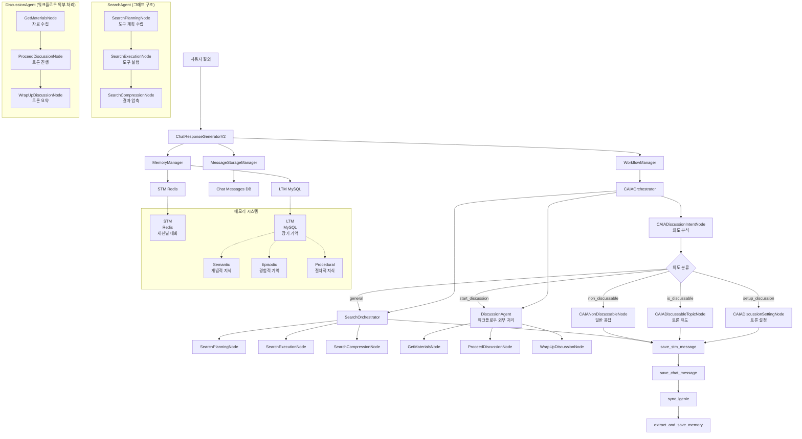

# CAIA (Chief AI Advisor) 아키텍처

## 워크플로우 다이어그램

## 아키텍처 특징

### 1. 의도 기반 라우팅 구조
- **CAIADiscussionIntentNode**: 사용자 질의를 분석하여 4가지 의도로 분류
  - `setup_discussion`: 토론 설정 요청 → CAIADiscussionSettingNode
  - `start_discussion`: 토론 시작 요청 → DiscussionAgent (워크플로우 외부)
  - `is_discussable`: 토론 가능한 주제 → CAIADiscussableTopicNode
  - `non_discussable`: 토론 불가능 → CAIANonDiscussableNode

### 2. 완전한 그래프 구조
- **SearchAgent**: SearchOrchestrator → SearchPlanningNode → SearchExecutionNode → SearchCompressionNode
- **DiscussionAgent**: GetMaterialsNode → ProceedDiscussionNode → WrapUpDiscussionNode (워크플로우 외부에서 SSE 스트리밍 처리)
- **각 에이전트가 독립적인 StateGraph로 동작**

### 3. 책임 분리된 컴포넌트
- **ChatResponseGeneratorV2**: 핵심 로직만 담당 (의도 분석, 초기화)
- **WorkflowManager**: 워크플로우 실행 및 SSE 스트리밍
- **MessageStorageManager**: 메시지 저장 로직 분리
- **MemoryManager**: STM/LTM 저장 로직 분리

### 4. 노드별 상세 설명

#### **ChatResponseGeneratorV2**
- 사용자 질의 수신 및 초기화
- 의도 분석 및 에이전트 라우팅
- 매니저들 간의 조율

#### **WorkflowManager**
- 워크플로우 실행 및 관리
- SSE 스트리밍 처리
- 노드별 결과 변환

#### **SearchOrchestrator (완전한 그래프 구조)**
- **SearchPlanningNode**: 검색 계획 수립
- **SearchExecutionNode**: 도구 실행
- **SearchCompressionNode**: 결과 압축

#### **CAIAOrchestrator (의도 기반 라우팅)**
- **CAIADiscussionIntentNode**: 사용자 질의 의도 분석 (4가지 의도 분류)
- **CAIADiscussionSettingNode**: 토론 설정 및 전문가 선정 (setup_discussion 의도)
- **CAIADiscussableTopicNode**: 토론 가능한 주제로 유도 (is_discussable 의도)
- **CAIANonDiscussableNode**: 일반 응답 생성 (non_discussable 의도)
- **SearchAgent**: 일반 질문 처리 (general 의도)

#### **DiscussionAgent (워크플로우 외부 처리)**
- **GetMaterialsNode**: 토론 자료 수집 (웹검색, LLM, 사내지식)
- **ProceedDiscussionNode**: 실시간 토론 시뮬레이션 (멀티 LLM 스트리밍)
- **WrapUpDiscussionNode**: 토론 요약 및 WOW Point 도출
- **특징**: SSE 스트리밍을 위해 워크플로우 외부에서 직접 처리됨

#### **MessageStorageManager**
- 토론 발언별 메시지 저장 (caia_discussion_{speaker_name} 형식)
- 일반 응답 메시지 저장
- 데이터베이스 연동

#### **MemoryManager**
- STM 메시지 저장 (Redis)
- LTM 추출 및 저장 (MySQL)
- 토론 스크립트 포함 저장

## 메모리 시스템 구조

### STM (Short-Term Memory)
- **저장소**: Redis
- **용도**: 세션별 대화 기록, 임시 정보
- **수명**: 세션 종료 시 삭제
- **토론 지원**: 발언자별 내용 저장 (speaker1, speaker2, host 등)

### LTM (Long-Term Memory)
- **저장소**: MySQL
- **용도**: 장기 기억, 개인화 정보
- **유형**: 
  - Semantic: 개념적 지식
  - Episodic: 경험적 기억
  - Procedural: 절차적 지식

## 의도 분류 상세

### 1. setup_discussion
- **의미**: 토론 설정 요청 (주제, 참여자 선정)
- **처리 노드**: CAIADiscussionSettingNode
- **예시**: "ESG경영을 잘하기 위한 방안에 대해 토론해줘", "마케팅 전문가 추가해줘"

### 2. start_discussion
- **의미**: 이미 설정된 토론 시작 요청
- **처리**: DiscussionAgent (워크플로우 외부에서 SSE 스트리밍 처리)
- **예시**: "진행해줘", "시작해줘"

### 3. is_discussable
- **의미**: 토론 가능한 주제로 유도 가능
- **처리 노드**: CAIADiscussableTopicNode
- **예시**: "ESG경영", "AI" (단순 키워드)

### 4. non_discussable
- **의미**: 토론 불가능한 일반 대화
- **처리 노드**: CAIANonDiscussableNode
- **예시**: "안녕", "고마워", "날씨"

## 워크플로우 처리 흐름

### 일반 워크플로우 (LangGraph)
1. **analyze_query**: 의도 분석
2. **의도별 노드 실행**: discussion_setting_node, discussable_topic_node, non_discussable_node, search_agent
3. **save_stm_message**: STM 저장
4. **save_chat_message**: 채팅 메시지 저장
5. **sync_lgenie**: LGenie 동기화
6. **extract_and_save_memory**: 메모리 추출 및 저장

### DiscussionAgent (워크플로우 외부)
- **start_discussion** 의도인 경우, 워크플로우를 종료하고 ChatResponseGenerator에서 직접 DiscussionAgent 실행
- SSE 스트리밍을 위해 워크플로우 외부에서 처리
- **GetMaterialsNode** → **ProceedDiscussionNode** → **WrapUpDiscussionNode** 순서로 실행

## 아키텍처 개선 효과

### 1. 확장성
- 새로운 에이전트 추가 시 동일한 패턴 적용 가능
- 각 에이전트가 독립적으로 개발 및 테스트 가능
- 의도 분류 추가 시 새로운 노드만 추가하면 됨

### 2. 유지보수성
- 각 컴포넌트의 책임이 명확히 분리
- 모듈화된 구조로 디버깅 및 수정 용이
- 의도별 노드가 독립적으로 동작

### 3. 테스트 용이성
- 각 노드를 독립적으로 테스트 가능
- 매니저별 단위 테스트 가능
- 의도별 시나리오 테스트 용이

### 4. 성능 최적화
- 병렬 처리 가능한 구조
- 메모리 사용량 최적화
- DiscussionAgent는 워크플로우 외부에서 처리하여 스트리밍 성능 최적화

### 5. 일관된 인터페이스
- 모든 에이전트가 동일한 패턴으로 동작
- 새로운 개발자가 이해하기 쉬운 구조
- 의도 기반 라우팅으로 명확한 흐름

